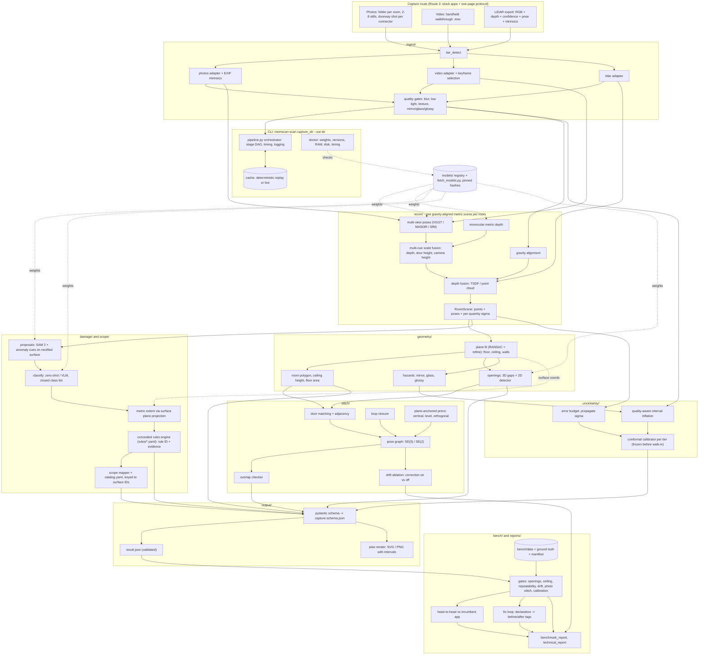

# Low-level design

```mermaid
flowchart TB
    subgraph CAP["Capture route (Route 2: stock apps + one-page protocol)"]
        P1["Photos: folder per room, 2-8 stills, doorway shot per connector"]
        P2["Video: handheld walkthrough .mov"]
        P3["LiDAR export: RGB + depth + confidence + pose + intrinsics"]
    end

    subgraph CLI["CLI: roomscan scan capture_dir --out dir"]
        ORCH["pipeline.py orchestrator: stage DAG, timing, logging"]
        CACHE[("cache: deterministic replay or live")]
        DOCTOR["doctor: weights, versions, RAM, disk, timing"]
    end

    subgraph ING["ingest/"]
        TD["tier_detect"]
        AD1["photos adapter + EXIF intrinsics"]
        AD2["video adapter + keyframe selection"]
        AD3["lidar adapter"]
        QG["quality gates: blur, low light, texture, mirror/glass/glossy"]
    end

    subgraph REC["recon/ - one gravity-aligned metric scene per room"]
        GRAV["gravity alignment"]
        MVG["multi-view poses (VGGT / MASt3R / SfM)"]
        MD["monocular metric depth"]
        SC["multi-cue scale fusion: depth, door height, camera height"]
        FUS["depth fusion: TSDF / point cloud"]
        SCENE["RoomScene: points + poses + per-quantity sigma"]
    end

    subgraph GEO["geometry/"]
        PL["plane fit (RANSAC + refine): floor, ceiling, walls"]
        LAY["room polygon, ceiling height, floor area"]
        OPN["openings: 3D gaps + 2D detector"]
        HAZ["hazards: mirror, glass, glossy"]
    end

    subgraph DMG["damage/ and scope/"]
        PRO["proposals: SAM 2 + anomaly cues on rectified surface"]
        CLS["classify: zero-shot / VLM, closed class list"]
        EXT["metric extent via surface plane projection"]
        RULES["concealed rules engine (rules/*.yaml): rule ID + evidence"]
        SCOPE["scope mapper + catalog.yaml, keyed to surface IDs"]
    end

    subgraph STI["stitch/"]
        DM["door matching + adjacency"]
        PG["pose graph: SE(3) / SE(2)"]
        LC["loop closure"]
        PA["plane-anchored priors: vertical, level, orthogonal"]
        OV["overlap checker"]
        ABL["drift ablation: correction on vs off"]
    end

    subgraph UNC["uncertainty/"]
        EB["error budget: propagate sigma"]
        QI["quality-aware interval inflation"]
        CONF["conformal calibrator per tier (frozen before walk-in)"]
    end

    subgraph OUT["output/"]
        SCH["pydantic schema -> capture.schema.json"]
        JSON["result.json (validated)"]
        REND["plan render: SVG / PNG with intervals"]
    end

    subgraph BENCH["bench/ and reports/"]
        DATA[("bench/data + ground truth + manifest")]
        GATES["gates: openings, ceiling, repeatability, drift, photo stitch, calibration"]
        H2H["head-to-head vs incumbent app"]
        FIX["fix loop: declaration -> before/after tags"]
        REP["benchmark_report, technical_report"]
    end

    MODELS[("models/ registry + fetch_models.py, pinned hashes")]

    P1 --> TD
    P2 --> TD
    P3 --> TD
    TD --> AD1 & AD2 & AD3
    AD1 & AD2 & AD3 --> QG
    QG --> ORCH
    ORCH <--> CACHE
    DOCTOR -.checks.-> MODELS
    MODELS -.weights.-> MVG & MD & PRO & CLS & OPN

    QG --> GRAV
    AD1 --> MVG
    AD2 --> MVG
    MVG --> SC
    MD --> SC
    AD3 --> FUS
    SC --> FUS
    GRAV --> FUS
    FUS --> SCENE

    SCENE --> PL --> LAY
    PL --> OPN
    PL --> HAZ
    SCENE --> PRO --> CLS --> EXT --> RULES --> SCOPE
    PL -.surface coords.-> EXT

    LAY --> DM
    OPN --> DM
    DM --> PG
    LC --> PG
    PA --> PG
    PG --> OV
    PG --> ABL

    SCENE --> EB
    HAZ --> QI
    QG --> QI
    EB --> CONF
    QI --> CONF
    CONF --> SCH
    OV --> SCH
    LAY --> SCH
    OPN --> SCH
    SCOPE --> SCH
    RULES --> SCH
    SCH --> JSON
    SCH --> REND

    JSON --> GATES
    DATA --> GATES
    GATES --> H2H
    GATES --> FIX
    ABL --> REP
    H2H --> REP
    FIX --> REP
    GATES --> REP
```
